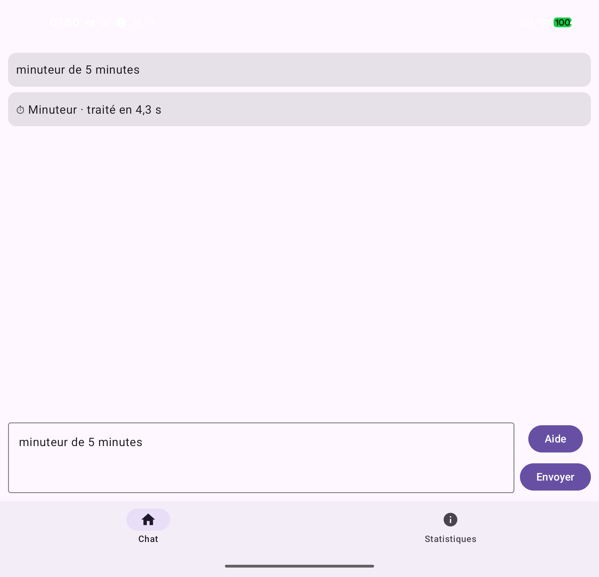
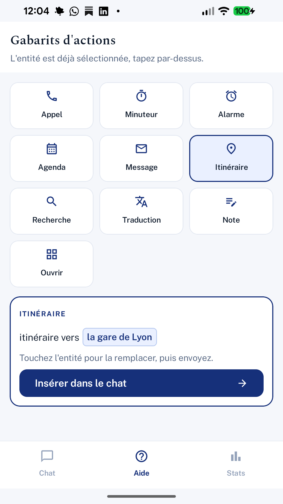
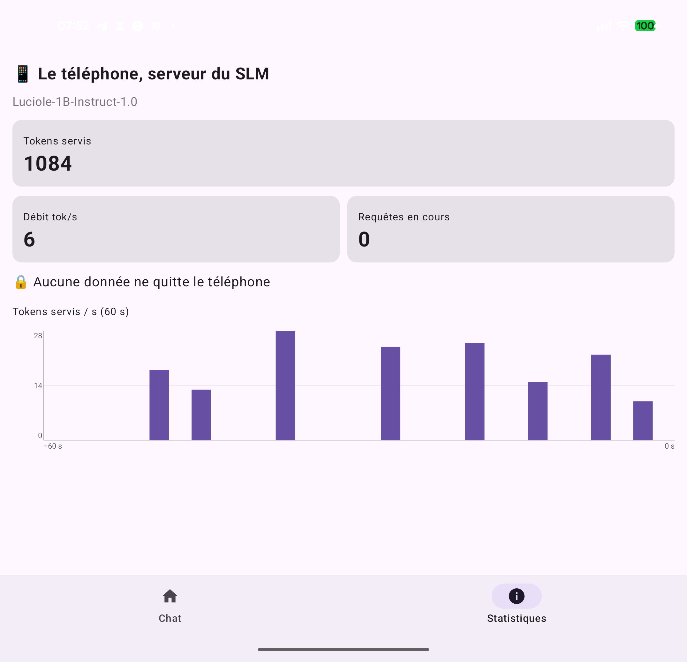

# 🔦 Luciole Mobile

> Application Android de **démonstration** : le SLM souverain français **Luciole‑1B** tourne **100 % sur le téléphone**, hors‑ligne, et **pilote de vraies actions** de l'appareil à partir d'une phrase en langage naturel.

[](LICENSE)


[-orange)](https://huggingface.co/mmaudet/Luciole-1B-Instruct-GGUF)

## ✨ L'idée en une phrase

Vous dites **« mets un minuteur de 5 minutes »**, **« appelle Paul Maudet »** ou **« itinéraire vers la gare de Lyon »**. Un modèle de langage **d'un milliard de paramètres** tourne **sur le téléphone lui‑même** (aucun cloud, aucune donnée qui sort), transforme votre phrase en une **action structurée**, et l'application **déclenche l'intent Android natif** correspondant : composer un numéro, ouvrir Maps, créer une alarme.

<p align="center">
  
</p>

## ⚠️ Nature de la démonstration (à lire)

C'est une **démonstration destinée à l'expérimentation**, **pas un assistant généraliste**, et c'est **volontaire**.

- **Luciole‑1B** est un **très petit modèle** (*SLM, Small Language Model*, environ 1 milliard de paramètres). À cette taille, et **sans phase complète d'instruction et d'alignement sur des préférences humaines**, un modèle a des **limites importantes** : il ne « sait pas tout », ne tient pas une conversation ouverte, et se trompe sur des demandes générales.
- **Mais** c'est précisément cette petite taille qui lui permet de **fonctionner sur un mobile**. Le compromis assumé : ces SLM ne sont réellement exploitables que sur des **cas d'usage très ciblés et soigneusement cadrés**.
- **C'est tout l'objet de cette démo** : montrer qu'on peut **inférer un modèle souverain directement sur un téléphone** et, malgré sa petite taille, en tirer un **cas d'usage précis et fiable**, ici **piloter un répertoire fini d'actions de l'appareil**. Le modèle se contente de **router** la phrase vers l'une de **11 actions**, via une **grammaire** qui *garantit* une sortie valide ; il n'improvise pas le format et n'invente pas d'action.

> 👉 À utiliser pour **tester, expérimenter, démontrer**. Ce n'est pas un produit fini.

## 🤖 Le modèle : Luciole

**[Luciole](https://huggingface.co/OpenLLM-France/Luciole-1B-Instruct-1.0)** est un modèle de langage **francophone et souverain** développé par **[OpenLLM‑France](https://github.com/OpenLLM-France)**. Cette démo utilise **`Luciole‑1B‑Instruct‑1.0`** (architecture Nemotron, environ 1 Md de paramètres), **quantifié en `Q4_K_M`** (≈ 969 Mo) pour tenir en mémoire et s'exécuter sur le téléphone via [`llama.cpp`](https://github.com/ggerganov/llama.cpp).

### 📥 Télécharger le modèle (GGUF prêt pour la démo)

Le GGUF quantifié utilisé par l'application est en téléchargement libre :

**→ [huggingface.co/mmaudet/Luciole-1B-Instruct-GGUF](https://huggingface.co/mmaudet/Luciole-1B-Instruct-GGUF)**

| Fichier | Quantification | Taille | Téléchargement |
|---|---|---|---|
| `Luciole-1B-Instruct-Q4_K_M.gguf` | Q4_K_M | ≈ 969 Mo | [⬇️ lien direct](https://huggingface.co/mmaudet/Luciole-1B-Instruct-GGUF/resolve/main/Luciole-1B-Instruct-Q4_K_M.gguf) |

```bash
# via la CLI Hugging Face
hf download mmaudet/Luciole-1B-Instruct-GGUF Luciole-1B-Instruct-Q4_K_M.gguf --local-dir .models
```

## 📱 Fonctionnalités

- **Chat** : tapez (ou dictez) une phrase, obtenez une action. La **durée de traitement** s'affiche sur chaque réponse (« traité en 3,7 s »).
- **11 actions** déclenchées par des **intents Android natifs** : ⏰ alarme, ⏱ minuteur, 📅 agenda (avec date et heure réelles), ✉️ message (e‑mail / SMS), 📞 **appel par numéro ou par nom** (résolu depuis vos contacts), 🗺 itinéraire, 🔍 recherche, 📲 ouvrir une app, 🔤 traduction, 📝 note, et un repli **« je ne sais pas »** assumé quand la demande sort du cadre.
- **Bouton Aide** : un panneau de **gabarits** (« itinéraire vers … ») où l'entité est **pré‑sélectionnée**, vous tapez directement par‑dessus.
- **Sécurité** : `ACTION_DIAL` (jamais d'appel automatique), aucun message envoyé automatiquement (l'éditeur s'ouvre, vous validez).
- **Bilingue** 🇫🇷 / 🇬🇧.

<p align="center">
  
</p>

## 🧠 Comment ça marche : architecture « cerveau / mains »

```
   Phrase libre
       │
       ▼
 ┌───────────────┐    JSON d'action garanti valide
 │   🧠 Cerveau   │    (décodage contraint par une grammaire GBNF)
 │  Luciole‑1B    │ ───────►  { "type": "appel", "destinataire": "Paul Maudet" }
 │  (on‑device)   │
 └───────────────┘
       │
       ▼
 ┌───────────────┐
 │   ✋ Mains      │  ───►  Intent Android natif  (ACTION_DIAL tel:…  vers le Téléphone)
 │  (déterministe)│        ou écran d'affichage (note, traduction, inconnu)
 └───────────────┘
```

- **🧠 Le cerveau** est une **interface enfichable**. Aujourd'hui : `CerveauServeur` (HTTP vers un serveur `llama.cpp` **local**, sur le téléphone, dans Termux). Prévu : `CerveauEmbarqué` (llama.cpp **dans l'APK**, via JNI, plus aucune dépendance externe).
- **La sortie est contrainte par une grammaire GBNF** : le modèle **ne peut produire** qu'un des 11 types d'action, en JSON valide. Pas de parsing fragile, pas d'hallucination de format.
- **✋ Les mains** traduisent l'action typée en intent Android natif. Comme l'app est au **premier plan**, les intents partent **sans restriction** (`BAL_ALLOW_VISIBLE_WINDOW`).

## 📊 Les statistiques : la preuve que tout est local

L'onglet **Statistiques** (« le téléphone, serveur du SLM ») montre en temps réel que c'est bien **le téléphone qui calcule** : tokens servis, débit en tokens par seconde, requêtes en cours, et un **histogramme** des tokens servis sur les 60 dernières secondes. Le cadenas le rappelle : **aucune donnée ne quitte le téléphone**.

<p align="center">
  
</p>

**L'impact du premier prompt sur la performance au démarrage.** À chaque requête, le modèle doit d'abord « lire » le **prompt système** : environ 1 300 tokens de règles et d'exemples qui cadrent les 11 actions. La **toute première** requête après le démarrage du serveur paie ce coût en entier et reste lente (de l'ordre de 14 s sur le téléphone). Les requêtes suivantes **réutilisent le cache** de ce préfixe (le *KV cache* de `llama.cpp`) et retombent autour de **3 à 4 s**. Pour que l'utilisateur ne subisse jamais ce premier coût, l'application envoie un **pré‑chauffage silencieux** au lancement : une requête « à blanc » qui réchauffe le cache, afin que la première vraie demande soit déjà rapide. C'est ce que montre l'histogramme : une montée en charge initiale, puis un débit qui se stabilise.

## 🔧 Détails techniques

| | |
|---|---|
| **Application** | Kotlin, Jetpack Compose, Material 3, minSdk 31, JDK 21 |
| **Inférence** | `llama.cpp` (`llama-server`) dans **Termux** sur le téléphone, modèle GGUF `Q4_K_M` |
| **Contrainte de sortie** | Grammaire **GBNF** (`--grammar-file`), JSON d'action toujours valide |
| **Contrat** | Prompt système et règles d'extraction (numéro, nom, **date**) re‑portés en Kotlin (parité testée avec la référence Python) |
| **Statistiques** | Métriques Prometheus `--metrics` du serveur, lues chaque seconde |
| **Robustesse** | timeout 60 s, **pré‑chauffage** du prompt au lancement, `configChanges` (survit au pliage du Pixel Fold), cleartext limité à `localhost` |
| **Tests** | **69** tests unitaires et Robolectric (modèle, parsing JSON, extraction, contacts, mapping d'intents, i18n) |

L'application a été **vérifiée en conditions réelles sur un Pixel 10 Pro Fold** : appel vers le Téléphone, itinéraire vers Maps, minuteur vers l'Horloge, agenda vers l'Agenda (avec l'heure), confirmés au logcat.

### Structure du dépôt

| Dossier | Rôle |
|---|---|
| `android/` | **L'application native** (le cœur de cette démo) |
| `server/` | Scripts de lancement du `llama-server` on‑device (Termux) |
| `contract/` | La **grammaire GBNF** et le schéma des actions |
| `web/` | Un client **web** alternatif servi par le téléphone (variante « toute la salle teste ») |
| `dispatcher/` | Le dispatcher Python de référence (preuve de concept initiale) |

## 🚀 Lancer la démo

1. **Télécharger le modèle** GGUF (voir la section ci‑dessus) dans `.models/`.
2. **Sur le téléphone (Termux)** : lancer le serveur avec la grammaire et les métriques :
   ```bash
   ./server/run-server.sh        # llama-server --grammar-file contract/actions.gbnf --metrics --port 8080
   ```
3. **Construire l'application** (depuis `android/`) :
   ```bash
   ./gradlew :app:assembleDebug
   adb install -r app/build/outputs/apk/debug/app-debug.apk
   ```
4. Ouvrir **Luciole**, dire une phrase, regarder l'action se déclencher, et l'onglet **Statistiques** monter, **sans réseau**.

## 📄 Licence

Distribué sous **GNU Affero General Public License v3.0**, voir [`LICENSE`](LICENSE).

## 🙏 Crédits

- Modèle **Luciole** : **[OpenLLM‑France](https://github.com/OpenLLM-France)** (`Luciole‑1B‑Instruct‑1.0`).
- Inférence on‑device : **[llama.cpp](https://github.com/ggerganov/llama.cpp)**.
- Démonstration par **Michel Maudet**.

> *Souveraineté numérique : un modèle français, sur votre téléphone, qui n'envoie rien à personne.* 🔦
